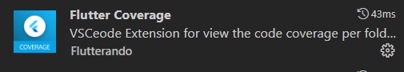
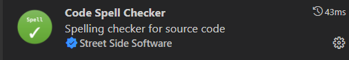
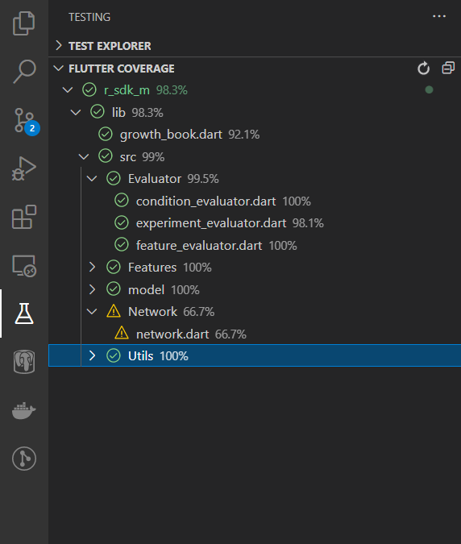
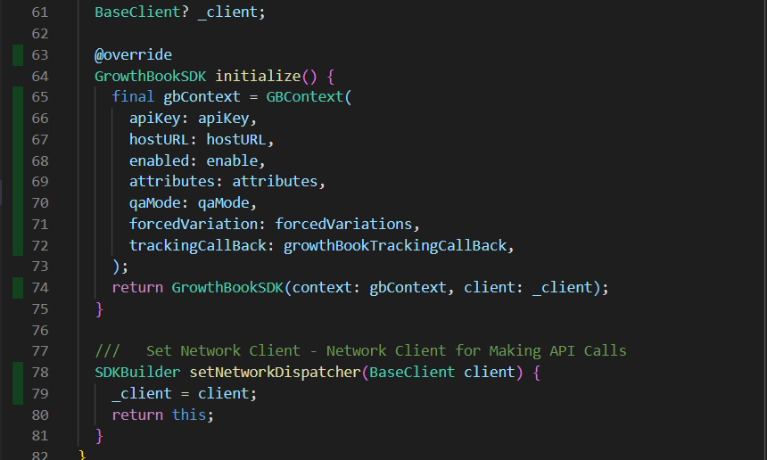

## Test

We can directly test code with inbuilt library test.

1. [Setup flutter sdk on local environment.]("https://docs.flutter.dev/get-started/install/macos")
2. [Clone repository.]("https://github.com/alippo-com/GrowthBook-SDK-Flutter")
3. Open root folder in vscode/preferred IDE.
4. If you are using vscode preferred to add this two extensions. 
   - Coverage Gutters.
   - Flutter Coverage.
 <table width="50%">
 <tr>
 <th>
 Coverage Gutters.
 </th>
 <th>
 Flutter Coverage.
 </th>
 <tr>
 <tr>
 <td></td>
 <td></td>
 </tr> 
 </table>  
5. Open your terminal and fire this command.

``` bash
flutter test --coverage
```
6. Open test panel from accessibility panel.
7. You can now analyze code coverage percentage vise.
8. Use Coverage Gutters extension in specific file to check coverage line vise.
 <table width="50%">
 <tr>
 <th>
 Coverage overview
 </th>
 <th>
Coverage Gutters
 </th>
 <tr>
 <tr>
 <td align="center"></td>
 <td align="center"></td>
 </tr> 
 </table>